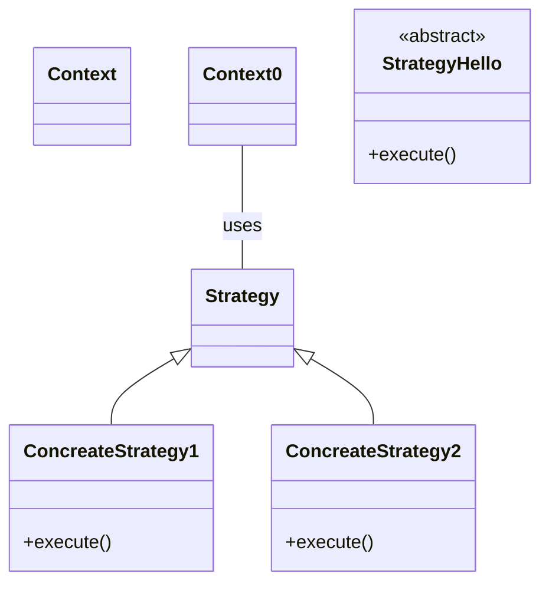

# Bridge pattern

```mermaid
classDiagram
class Abstraction {
    <<abstract>>
}
RefinedAbstraction1 --|> Abstraction
RefinedAbstraction2 ==|> Abstraction
class Implemntation {
    <<abstract>>
    +implementation()
}
Abstraction o-- Implementation :uses
ConcreteImplementation <|-- ConcreteImplementation1
ConcreteImplementation <|-- ConcreteImplementation2
```